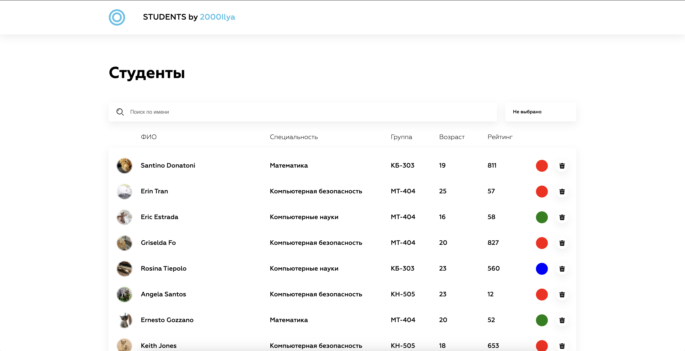

## Локальная сборка приложения с использованием Docker

В корневой папке проекта выполнить команды:
```bash
# Собрать контейнер
docker-compose build

# Запустить контейнер
docker-compose up
```

```bash
# Удалить все запущенные контейнеры
docker-compose down
```

Затем нужно перейти по ссылке <a href="http://localhost:3000/">http://localhost:3000/</a>

## Локальный запуск приложения с использованием Node
В корневой папке проекта выполнить команды:

```bash
# Установить зависимости
npm i

# Запустить приложение
npm run dev
```

## Приложение

Приложение имеет два вида:

### Мобильный 
<center></center>

### Десктопный
<center></center>